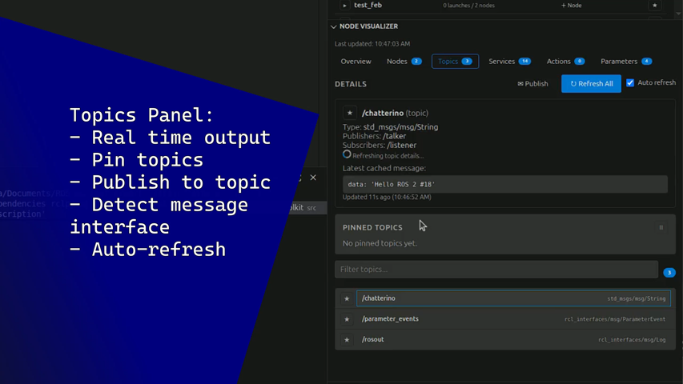

# ROS Dev Toolkit

ROS Dev Toolkit is a VS Code extension for ROS development that keeps package creation, node/launch execution, and runtime graph inspection in one place.

Tested on **ROS 2 Jazzy**.

## Core capabilities

- Auto-detect ROS packages in the current workspace.
- Create new ROS packages from the sidebar UI.
- Create NEW Nodes to existing `ament_cmake`/`ament_python` packages.
- Auto-detect runnable nodes and launch files per package.
- Run nodes and launch files directly from VS Code.
- Save and reuse named argument configurations for runs and launches.
- Pin packages, nodes, launch files, and topics for fast access.
- Track active launch terminals and choose a preferred terminal.
- Smart pre-launch build check:
  - Evaluates whether selected packages need rebuilding. This also includes DEPENDENCIES.
  - Calls `colcon build` only on required packages when launching/running, then starts the target automatically.
- Node Visualizer:
  - View nodes, topics, services, actions, and parameters.
  - Inspect node/topic relationships and details.
  - Publish to topics using generated payload templates.
  - Pin topics and monitor latest messages live.

## Product tour

### Create package


### Create node


### Launch with arguments


### Smart auto build check


### Package manager panel


### Node visualizer topic tools



## VS Code views

The extension adds a **ROS Dev Toolkit** activity bar container with:

- **Package Manager**
- **Node Visualizer**

## Roadmap

- More actions for the Services/Parameters panels.
- IntelliSense when writing code.
- URDF viewer.

## Recommended settings

- `rosDevToolkit.rosSetupPath`: Absolute path to your ROS `setup.bash`.
- `rosDevToolkit.preLaunchBuildCheck`: Enable smart build check before run/launch.
- `rosDevToolkit.symlinkInstall`: Use `--symlink-install` for faster Python iteration.
- `rosDevToolkit.launchInExternalTerminal`: Use an external terminal for GUI apps (RViz, Gazebo, rqt).

## Development setup

1. Install dependencies: `npm install`
2. Build the extension: `npm run compile`
3. Start debugging in VS Code with the `Run Extension` launch config

## Publish

```bash
npx @vscode/vsce --version
npx @vscode/vsce package
npx @vscode/vsce login <publisher-name>
npx @vscode/vsce publish
```
